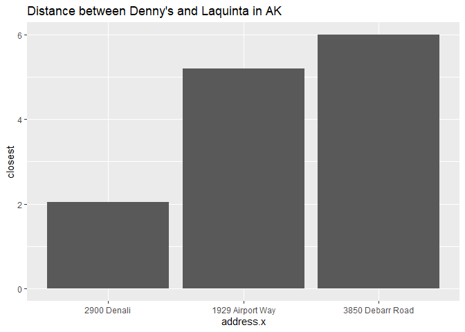
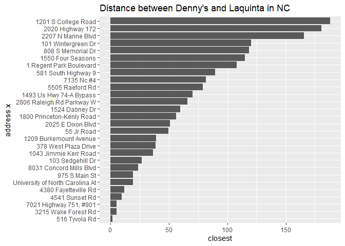
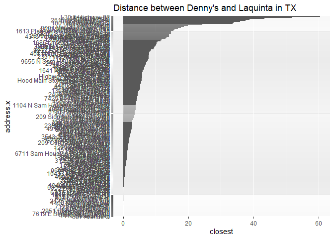
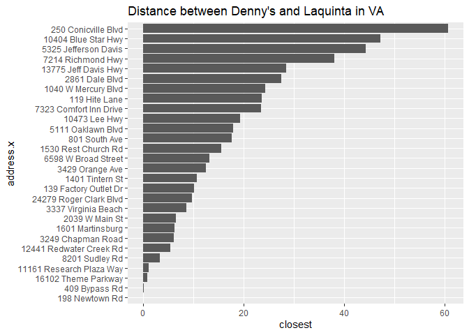

Lab 04 - La Quinta is Spanish for next to Denny’s, Pt. 2
================
Rachel Good
2022-03-12

### Load packages and data

``` r
library(tidyverse) 
library(dsbox) 
library(dplyr)
```

``` r
states <- read_csv("data/states.csv")
```

``` r
data(dennys)
data(laquinta)
```

### Exercise 1

``` r
dn_ak <- dennys %>% 
  filter(state == "AK")
nrow(dn_ak)
```

    ## [1] 3

### Exercise 2

``` r
lq_ak <- laquinta %>% 
  filter(state == "AK")
nrow(lq_ak)
```

    ## [1] 2

### Exercise 3

``` r
dn_lq_ak <- full_join(dn_ak, lq_ak, by = "state")
dn_lq_ak
```

    ## # A tibble: 6 x 11
    ##   address.x     city.x state zip.x longitude.x latitude.x address.y city.y zip.y
    ##   <chr>         <chr>  <chr> <chr>       <dbl>      <dbl> <chr>     <chr>  <chr>
    ## 1 2900 Denali   Ancho~ AK    99503       -150.       61.2 3501 Min~ "\nAn~ 99503
    ## 2 2900 Denali   Ancho~ AK    99503       -150.       61.2 4920 Dal~ "\nFa~ 99709
    ## 3 3850 Debarr ~ Ancho~ AK    99508       -150.       61.2 3501 Min~ "\nAn~ 99503
    ## 4 3850 Debarr ~ Ancho~ AK    99508       -150.       61.2 4920 Dal~ "\nFa~ 99709
    ## 5 1929 Airport~ Fairb~ AK    99701       -148.       64.8 3501 Min~ "\nAn~ 99503
    ## 6 1929 Airport~ Fairb~ AK    99701       -148.       64.8 4920 Dal~ "\nFa~ 99709
    ## # ... with 2 more variables: longitude.y <dbl>, latitude.y <dbl>

### Exercise 4

There are 6 observations in the dn\_lq\_ak data frame. The variables
are: .x\[address, city, state, zip, longitude, latitude\] and
.y\[address, city, zip, longitude, latitude\]

### Exercise 5

``` r
haversine <- function(long1, lat1, long2, lat2, round = 3) {
  # convert to radians
  long1 = long1 * pi / 180
  lat1  = lat1  * pi / 180
  long2 = long2 * pi / 180
  lat2  = lat2  * pi / 180
  
  R = 6371 # Earth mean radius in km
  
  a = sin((lat2 - lat1)/2)^2 + cos(lat1) * cos(lat2) * sin((long2 - long1)/2)^2
  d = R * 2 * asin(sqrt(a))
  
  return( round(d,round) ) # distance in km
}
```

### Exercise 6

``` r
dn_lq_ak <- dn_lq_ak %>% 
  mutate(distance = haversine(longitude.x, latitude.x, longitude.y, latitude.y))
```

### Exercise 7

``` r
dn_lq_ak_mindist <- dn_lq_ak %>%
  group_by(address.x) %>%
  summarize(closest = min(distance))
```

### Exercise 8

``` r
library(forcats)
dn_lq_ak_mindist %>% 
  mutate(address.x = fct_reorder(address.x, closest)) %>% 
ggplot(dn_lq_ak_mindist, mapping = aes(x = address.x, y = closest)) +
  geom_col() +
  ggtitle("Distance between Denny's and Laquinta in AK")
```

<!-- -->

``` r
summary(dn_lq_ak_mindist)
```

    ##   address.x            closest     
    ##  Length:3           Min.   :2.035  
    ##  Class :character   1st Qu.:3.616  
    ##  Mode  :character   Median :5.197  
    ##                     Mean   :4.410  
    ##                     3rd Qu.:5.598  
    ##                     Max.   :5.998

### Exercise 9

``` r
dn_nc <- dennys %>% 
  filter(state == "NC")
nrow(dn_nc)
```

    ## [1] 28

``` r
lq_nc <- laquinta %>% 
  filter(state == "NC")
nrow(lq_nc)
```

    ## [1] 12

``` r
dn_lq_nc <- full_join(dn_nc, lq_nc, by = "state")
dn_lq_nc
```

    ## # A tibble: 336 x 11
    ##    address.x    city.x state zip.x longitude.x latitude.x address.y city.y zip.y
    ##    <chr>        <chr>  <chr> <chr>       <dbl>      <dbl> <chr>     <chr>  <chr>
    ##  1 1 Regent Pa~ Ashev~ NC    28806       -82.6       35.6 165 Hwy ~ "\nBo~ 28607
    ##  2 1 Regent Pa~ Ashev~ NC    28806       -82.6       35.6 3127 Slo~ "\nCh~ 28208
    ##  3 1 Regent Pa~ Ashev~ NC    28806       -82.6       35.6 4900 Sou~ "\nCh~ 28217
    ##  4 1 Regent Pa~ Ashev~ NC    28806       -82.6       35.6 4414 Dur~ "\nDu~ 27707
    ##  5 1 Regent Pa~ Ashev~ NC    28806       -82.6       35.6 1910 Wes~ "\nDu~ 27713
    ##  6 1 Regent Pa~ Ashev~ NC    28806       -82.6       35.6 1201 Lan~ "\nGr~ 27407
    ##  7 1 Regent Pa~ Ashev~ NC    28806       -82.6       35.6 1607 Fai~ "\nCo~ 28613
    ##  8 1 Regent Pa~ Ashev~ NC    28806       -82.6       35.6 191 Cres~ "\nCa~ 27518
    ##  9 1 Regent Pa~ Ashev~ NC    28806       -82.6       35.6 2211 Sum~ "\nRa~ 27612
    ## 10 1 Regent Pa~ Ashev~ NC    28806       -82.6       35.6 1001 Aer~ "\nMo~ 27560
    ## # ... with 326 more rows, and 2 more variables: longitude.y <dbl>,
    ## #   latitude.y <dbl>

``` r
dn_lq_nc <- dn_lq_nc %>% 
  mutate(distance = haversine(longitude.x, latitude.x, longitude.y, latitude.y))

dn_lq_nc_mindist <- dn_lq_nc %>%
  group_by(address.x) %>%
  summarize(closest = min(distance))

dn_lq_nc_mindist %>% 
  mutate(address.x = fct_reorder(address.x, closest)) %>% 
ggplot(dn_lq_nc_mindist, mapping = aes(x = address.x, y = closest)) +
  geom_col() +
  coord_flip() +
  ggtitle("Distance between Denny's and Laquinta in NC")
```

<!-- -->

``` r
summary(dn_lq_nc_mindist)
```

    ##   address.x            closest       
    ##  Length:28          Min.   :  1.779  
    ##  Class :character   1st Qu.: 22.388  
    ##  Mode  :character   Median : 53.456  
    ##                     Mean   : 65.444  
    ##                     3rd Qu.: 93.985  
    ##                     Max.   :187.935

### Exercise 10

``` r
dn_tx <- dennys %>% 
  filter(state == "TX")
nrow(dn_tx)
```

    ## [1] 200

``` r
lq_tx <- laquinta %>% 
  filter(state == "TX")
nrow(lq_tx)
```

    ## [1] 237

``` r
dn_lq_tx <- full_join(dn_tx, lq_tx, by = "state")
dn_lq_tx
```

    ## # A tibble: 47,400 x 11
    ##    address.x    city.x state zip.x longitude.x latitude.x address.y city.y zip.y
    ##    <chr>        <chr>  <chr> <chr>       <dbl>      <dbl> <chr>     <chr>  <chr>
    ##  1 120 East I-~ Abile~ TX    79601       -99.6       32.4 3018 Cat~ "\nAb~ 79606
    ##  2 120 East I-~ Abile~ TX    79601       -99.6       32.4 3501 Wes~ "\nAb~ 79601
    ##  3 120 East I-~ Abile~ TX    79601       -99.6       32.4 14925 La~ "\nAd~ 75254
    ##  4 120 East I-~ Abile~ TX    79601       -99.6       32.4 909 East~ "\nAl~ 78516
    ##  5 120 East I-~ Abile~ TX    79601       -99.6       32.4 2400 Eas~ "\nAl~ 78332
    ##  6 120 East I-~ Abile~ TX    79601       -99.6       32.4 1220 Nor~ "\nAl~ 75013
    ##  7 120 East I-~ Abile~ TX    79601       -99.6       32.4 1165 Hwy~ "\nAl~ 76009
    ##  8 120 East I-~ Abile~ TX    79601       -99.6       32.4 880 Sout~ "\nAl~ 77511
    ##  9 120 East I-~ Abile~ TX    79601       -99.6       32.4 1708 Int~ "\nAm~ 79103
    ## 10 120 East I-~ Abile~ TX    79601       -99.6       32.4 9305 Eas~ "\nAm~ 79118
    ## # ... with 47,390 more rows, and 2 more variables: longitude.y <dbl>,
    ## #   latitude.y <dbl>

``` r
dn_lq_tx <- dn_lq_tx %>% 
  mutate(distance = haversine(longitude.x, latitude.x, longitude.y, latitude.y))

dn_lq_tx_mindist <- dn_lq_tx %>%
  group_by(address.x) %>%
  summarize(closest = min(distance))
            
dn_lq_tx_mindist %>% 
  mutate(address.x = fct_reorder(address.x, closest)) %>% 
ggplot(dn_lq_tx_mindist, mapping = aes(x = address.x, y = closest)) +
  geom_col() +
  coord_flip()+
  ggtitle("Distance between Denny's and Laquinta in TX")
```

<!-- -->

``` r
summary(dn_lq_tx_mindist)
```

    ##   address.x            closest       
    ##  Length:200         Min.   : 0.0160  
    ##  Class :character   1st Qu.: 0.7305  
    ##  Mode  :character   Median : 3.3715  
    ##                     Mean   : 5.7918  
    ##                     3rd Qu.: 6.6303  
    ##                     Max.   :60.5820

### Exercise 11

``` r
dn_va <- dennys %>% 
  filter(state == "VA")
nrow(dn_va)
```

    ## [1] 28

``` r
lq_va <- laquinta %>% 
  filter(state == "VA")
nrow(lq_va)
```

    ## [1] 14

``` r
dn_lq_va <- full_join(dn_va, lq_va, by = "state")
dn_lq_va
```

    ## # A tibble: 392 x 11
    ##    address.x    city.x state zip.x longitude.x latitude.x address.y city.y zip.y
    ##    <chr>        <chr>  <chr> <chr>       <dbl>      <dbl> <chr>     <chr>  <chr>
    ##  1 7214 Richmo~ Alexa~ VA    22306       -77.1       38.8 1803 Emm~ "\nCh~ 22901
    ##  2 7214 Richmo~ Alexa~ VA    22306       -77.1       38.8 3320 Can~ "\nLy~ 24502
    ##  3 7214 Richmo~ Alexa~ VA    22306       -77.1       38.8 6950 Nov~ "\nMa~ 20109
    ##  4 7214 Richmo~ Alexa~ VA    22306       -77.1       38.8 1387 Nor~ "\nNo~ 23502
    ##  5 7214 Richmo~ Alexa~ VA    22306       -77.1       38.8 192 Newt~ "\nVi~ 23462
    ##  6 7214 Richmo~ Alexa~ VA    22306       -77.1       38.8 1450 Tyl~ "\nRa~ 24141
    ##  7 7214 Richmo~ Alexa~ VA    22306       -77.1       38.8 1301 Hug~ "\nMi~ 23113
    ##  8 7214 Richmo~ Alexa~ VA    22306       -77.1       38.8 16280 In~ "\nDo~ 23047
    ##  9 7214 Richmo~ Alexa~ VA    22306       -77.1       38.8 9040 Pam~ "\nRi~ 23237
    ## 10 7214 Richmo~ Alexa~ VA    22306       -77.1       38.8 140 Sher~ "\nSa~ 24153
    ## # ... with 382 more rows, and 2 more variables: longitude.y <dbl>,
    ## #   latitude.y <dbl>

``` r
dn_lq_va <- dn_lq_va %>% 
  mutate(distance = haversine(longitude.x, latitude.x, longitude.y, latitude.y))

dn_lq_va_mindist <- dn_lq_va %>%
  group_by(address.x) %>%
  summarize(closest = min(distance))
            
dn_lq_va_mindist %>% 
  mutate(address.x = fct_reorder(address.x, closest)) %>% 
ggplot(dn_lq_va_mindist, mapping = aes(x = address.x, y = closest)) +
  geom_col() +
  coord_flip()+
  ggtitle("Distance between Denny's and Laquinta in VA")
```

<!-- -->

``` r
summary(dn_lq_va_mindist)
```

    ##   address.x            closest      
    ##  Length:28          Min.   : 0.052  
    ##  Class :character   1st Qu.: 6.253  
    ##  Mode  :character   Median :12.899  
    ##                     Mean   :17.248  
    ##                     3rd Qu.:23.818  
    ##                     Max.   :60.730

### Exercise 12

It appears that the Mitch Hedberg joke applies best to Texas considering
the number of locations that have a distance of less than 10 miles
between them.
